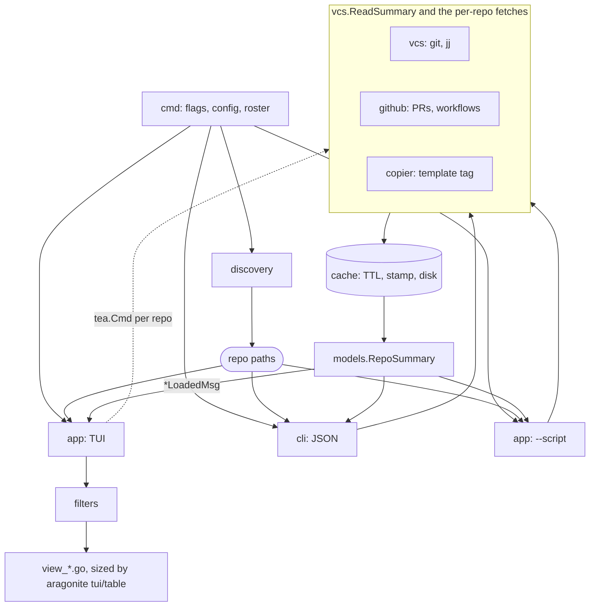

# Design

Project-specific architecture, design decisions, and domain context for
gh-repo-dashboard. Generic Go and workflow conventions live in [AGENTS.md](AGENTS.md);
setup and task commands live in [CONTRIBUTING.md](CONTRIBUTING.md).

## Overview

K9s-inspired Bubble Tea TUI for managing multiple git and jj repositories with
progressive loading, filtering, GitHub PR integration, and batch maintenance tasks.
Besides the TUI, two headless modes share the same internals: `--cli` prints repo
summaries as JSON (optionally narrowed by `--filter <predicate>`) and `--script`
replays `:command` lines from a file or stdin. A script runs every line even
after one fails and exits nonzero at the end, so a rejected command or an
unparsable predicate cannot pass for success.

- Framework: Bubble Tea (Go TUI framework)
- Theme: Catppuccin Macchiato
- Philosophy: minimal color, single unified background, borders for hierarchy, vim-style keybindings

## Architecture

Three front ends share one set of internals. The TUI is the only one with an
event loop, so it reads progressively through messages while `--cli` and
`--script` read the same data synchronously.

Everything network-derived goes through `cache`, keyed by upstream so parallel
checkouts of one remote share a read (see
[cache-identity-and-invalidation.md](docs/design/cache-identity-and-invalidation.md)).
`vcs` is the only package that shells out to git or jj, `models` holds the
shapes all three front ends render, aragonite's `tui/table` sizes every table,
and its `tui/markdown` flattens the markdown and raw HTML a pull request body
carries into terminal lines, folding `
` blocks to their summary so a bot's
changelog costs a pane one line instead of hundreds.

## VCS Abstraction

An interface-based abstraction supports multiple version control systems.

- `Operations` (in `vcs/operations.go`) composes three narrower interfaces: `StatusReader`
  (summary-level queries), `DetailReader` (branch/stash/worktree/commit drill-downs), and
  `Mutator` (write operations)
- `GitOperations` and `JJOperations` implement it
- `DetectVCSType()` auto-detects by directory presence (`.git` or `.jj`)
- `GetOperations()` returns the appropriate implementation
- Colocated repos (both `.git` and `.jj`) prefer jj

### Git vs JJ concept mapping

| Concept | Git | JJ (Jujutsu) | Notes |
|---------|-----|--------------|-------|
| Current location | HEAD | @ (working copy) | jj always has a working copy change |
| Branch | branch | bookmark | jj bookmarks are similar to git branches |
| Staged changes | index/staging | N/A | jj automatically tracks all changes |
| Uncommitted | unstaged + staged | working copy | Different mental model |
| Ahead/behind | ahead/behind | ahead/behind | Similar concept |
| Remote tracking | upstream branch | tracking bookmark | Similar |
| Stash | stash | N/A | jj can create changes instead |
| Worktree | worktree | workspace | jj workspaces are more powerful |

Read operations include `GetRepoSummary`, `GetCurrentBranch`, `GetBranchList`,
`GetStashList` (git only), `GetWorktreeList`, `GetCommitLog`, and `GetAheadBehind`.
File-status counts are computed internally by `GetRepoSummary` rather than exposed
as separate interface methods. `models.BranchInfo` carries a `Head` tip-OID field
(git `for-each-ref`'s `%(objectname)`, jj's bookmark target commit id) used to
detect squash-merged branches whose tip matches a merged PR's head OID even though
the branch itself was never merged. Every `Mutator` method returns
`(success bool, message string)` alongside an error, so the UI can report a
per-repo outcome even where the operation itself did not error. Beyond the batch
tasks (`FetchAll`, `PruneRemote`, `CleanupMergedBranches`) it covers the
single-item writes the focused view's panels offer: `SwitchBranch`,
`PushBranch`, `DeleteBranch`, `ApplyStash`, and `DropStash`. `DeleteBranch`
refuses an unmerged branch unless the caller passes `force`, which only a caller
that has verified the branch is squash-merged should do. jj has no stash, so its
`ApplyStash` and `DropStash` report that rather than pretending to work.
`CleanupMergedBranches(ctx, repoPath, squashMerged
[]string)` additionally takes the caller-verified squash-merged branch names: git
deletes them with `-D` alongside true-merges deleted with `-d`, reports per-branch
failures in the result message, and returns success only when every deletion
succeeded. Both paths skip the current branch and anything checked out in a
worktree. Merged branches come from `for-each-ref --merged`, not `git branch
--merged`, whose porcelain marks (`* `, `+ `, and a detached-HEAD line) are not
branch names. `GitOperations` and
`JJOperations` each also expose a `PreviewMergedBranches` method (outside the
`Mutator` interface, since it's read-only) that reports what cleanup would delete
without deleting anything, backing the `:cleanup --dry-run` command.

### GitHub CLI integration

GitHub integration works for both git and jj via the `gh` CLI. For git repos and
colocated jj repos it uses the `.git` directory; for non-colocated jj repos it sets
`GIT_DIR` to `.jj/repo/store/git`. The `GetGitHubEnv()` helper in `vcs/factory.go`
handles this transparently. If `gh` is missing, PR columns show a dash rather than failing.

`GetPRsForRepo` reads the list as two filtered pages rather than one unfiltered
page. The `statusCheckRollup`, `comments`, and `reviews` fields are each walked
per pull request, so the cost is linear in the page size, and a repo with enough
open pull requests takes GitHub's GraphQL gateway past its own timeout and
returns 504. Thirty per page fits with room to spare. The pages are split by
author (`-author:@me` and `--author @me`) because a repo whose pull requests all
belong to a bot has nothing on the operator's page, while the operator's older
work has already fallen off a busy repo's recent list, so neither page alone
covers both. Results merge by number, newest first. A failed fetch is never
cached: an empty list would otherwise read as "this repo has no pull requests"
for the whole TTL and hide the panel on the strength of a timeout.

## Glossary

This app's own vocabulary: the two top-level views, the Repos list's columns,
and the five panels the single-repo view opens into. Skips anything a git or
GitHub user already knows (upstream, ahead/behind, worktree, and so on); see
the [git vs jj mapping](#git-vs-jj-concept-mapping) above for those.

### Views

| Term | Meaning |
|------|---------|
| Repos tab (`[R]`) | The default view: one row per scanned repo. Pressing `v` on a row opens the expand region, an inline detail block for that one repo (its branches and pull requests) without leaving the list. Pressing enter opens the single-repo view. |
| PRs tab (`[P]`) | Every open pull request across the scanned repos, joined against each repo's local branches so a PR with no local checkout and a local branch with no PR are both visible in one table (internally the "fleet map" or "PR map", `prmap.go`). |
| Single-repo view | Opened by selecting a repo from the Repos tab: a breadcrumb naming the repo, and a grid of panels beside a detail pane. |
| Panel | One of the five boxes in the single-repo view's left column: Status (`s`), Branches (`b`), Peers (`e`), Stashes (`t`), Notes (`n`). Each panel's own key both jumps to it and, in the collapsed grid, shows its row count. A jj repo has no Stashes panel. |
| Detail pane / full preview | The pane to the right of the panel column. It always shows the focused panel's selected row in full; for Status, that full preview is the repo's identity facts (vcs, protocol, detached/dirty state, PR, checkouts, config drift) that don't fit the panel's own two-line collapsed view. |

### Repos list columns

| Column | Meaning |
|--------|---------|
| BRANCH | The branch currently checked out. |
| BRs | The repo's total local branch count, read once per repo as soon as its summary lands. |
| STATUS | The working tree's state: sync position against the upstream plus uncommitted file counts. |
| PEERS | How many *other* checkouts in the scanned fleet share this repo's branch and are tracking one of its open pull requests. Empty for the common case of a repo with no other checkout in play. |
| PR | The pull request open on the branch currently checked out here, or a dash if there isn't one. |
| PRs | The repo's total count of open pull requests, regardless of which branch is checked out. |
| TEMPLATE | Whether the repo has drifted from the copier template it was generated from. |
| CI | The default branch's most recent workflow run rollup. |

`PR` and `PRs` answer different questions and sit side by side, which reads
easily once you know the distinction but is easy to misread at a glance;
see the note below.

### Terminology worth reconsidering

- `PR` (singular, current branch's own pull request) beside `PRs` (plural,
  the repo's total open count) is precise but relies on a reader noticing
  the trailing `s`. A clearer pair of names (e.g. `THIS PR` / `OPEN PRs`, or
  moving one of the two into the STATUS line) would remove the need to read
  carefully to tell them apart.
- `BRs` is a fleet-dashboard abbreviation with no standard meaning outside
  this app; `Br` or spelling it `BRANCHES` (there is no separate branch-list
  column to collide with) would read more immediately.
- PEERS answers a narrower question than its name suggests: it is peers
  relevant to an open pull request, not every other checkout of the repo. A
  name like `RELEVANT PEERS` or `PR PEERS` would set that expectation up
  front instead of requiring a look at the glossary.

### Why branch loading is slower in the single-repo view than the list

Branch enumeration itself is not the expensive part: `GetBranchList` reads
every local branch's name, upstream, and ahead/behind count with one
`for-each-ref` call regardless of branch count, and the Repos list's BRs
column runs that same one call per repo. What is expensive is opening or
switching branches in the single-repo detail view, which chains roughly ten
sequential subprocess spawns (`for-each-ref`, `stash list`, `worktree list`,
plus the seven separate git calls inside `GetRepoSummary`) and two GitHub
API round trips, one after another with nothing running concurrently.
Selecting a different branch re-runs the whole `GetRepoSummary` chain again
rather than reusing the summary the detail view already loaded, so every
branch click pays that cost a second time. None of this is a per-branch
cost; it is a long serial chain that runs once per view a fleet with many
branches happens to make more often.

## Batch Tasks

`BatchTaskRunner` runs maintenance tasks sequentially across the currently filtered
repositories, using the VCS factory per repo, tracking progress, and continuing on
failure (failures are highlighted, not fatal). Progress is reported via Tea messages.

Batch operations are read-only by default; write operations require an explicit
keybinding. Scope is always the filtered set, making the blast radius explicit.
Tasks that delete refs are parked behind `ViewModeConfirm` first, naming the
repos and the count, whether they were started by the operator keys, `:cleanup`,
or a text object.

`batch.CleanupMerged` and `batch.PreviewCleanup` detect squash-merged branches by
comparing `internal/github.GetMergedPRHeads` (cached merged PR head OIDs) against
`GetBranchList`'s `Head` field, reading through swappable `getMergedPRHeads`/
`getOperations` package-level seams (`internal/batch/export_test.go`) so tests can
stub gh/git access without shelling out. `PreviewCleanup` backs `:cleanup
--dry-run`: it runs the same detection plus each VCS's `PreviewMergedBranches` and
reports what would be deleted without calling `CleanupMergedBranches`.

Adding a new batch task:

1. Add the method to the `Mutator` interface (`vcs/operations.go`)
2. Implement it in both `GitOperations` (`vcs/git.go`) and `JJOperations` (`vcs/jj.go`)
3. Add a task function in `batch/tasks.go` wrapping the VCS call
4. Handle it in `app/update.go` via `m.startBatchTask(...)`
5. Register the keybinding in `app/keymap.go`
6. Add tests in `internal/batch/batch_test.go`

## Copier Template Info

`internal/copier` reads a repo's `.copier-answers.yml` (copier's default
answers-file name) for `_src_path` and `_commit`, exposed as
`models.RepoSummary.TemplateInfo` (nil for non-copier repos). When `_commit`
parses as a semver tag, it's compared against the template's latest upstream
tag (`git ls-remote --tags --refs <_src_path>`); when it doesn't (a raw commit
SHA or branch ref), currency can't be judged, so the TUI just flags it as
non-tag rather than guessing. The latest-tag lookup is cached in
`cache.CopierLatestTagCache` keyed by `_src_path` rather than by repo path, so
every repo generated from the same template shares one network call. The pull
request and workflow caches follow the same shape through `cache.RemoteScope`. The repo
list's TEMPLATE column shows the installed tag, `tag→latest` when behind, or
the installed ref plus a warning icon when it isn't a tag.

## Filtering Architecture

Filtering is compositional: `FilterMode -> SearchText -> SortMode -> Display`. For
example, the `DIRTY` filter plus an `api` search yields dirty repos containing "api".

- Filter modes: `ALL`, `DIRTY`, `AHEAD`, `BEHIND`, `HAS_PR`, `HAS_STASH`, `HAS_NOTES`, `GIT` (multi-filter with AND logic). The `f` dock shows one row per mode with its cycle state (off, on, `NOT`) and a live "if on" count: the fleet-wide total that mode would produce combined with every other filter, the predicate, and the search already active, not that mode evaluated alone.
- Sort modes: `NAME`, `MODIFIED`, `STATUS`, `BRANCH`, with multi-field priority and ASC/DESC direction
- Search: matches repo name or checked-out branch by default, updating in real time; falls back to fuzzy matching (`sahilm/fuzzy`) on the name when nothing matches as a substring/glob. Scope prefixes: `r:` name, `b:` branch, `p:` PR number/title, `t:` copier template source, `n:` note body content (only searches notes already loaded; a repo whose notes haven't fetched yet just doesn't match), `c:` commit recency (`c:<7d` within, `c:>30d` older than, bare `c:7d` defaults to within). Every scope supports glob syntax via `filters.GlobMatch`: a bare query matches anywhere, `^`/`$` anchor an edge (both together for an exact match), `*`/`?` are wildcards within the query, and `\` escapes a literal `^`, `$`, `*`, or `?`.
- `filters.Predicate[T]` is generic over its subject type, so the same `and`/`or`/`not`/parens parser (`filters.ParsePredicate`) serves two atom maps: `filters.RepoAtoms()` (`ahead`, `behind`, `clean` = `not dirty`, `dirty`, `has_pr`, `has_stash`, `has_notes`, `git`, plus dock-absent `jj`, `https`, `ssh`, `has_upstream`, `config_override`, `error`, `template_drift`) and `filters.PRAtoms()` (`draft`, `approved`, `changes_requested`, `review_required`, `needs_reviewer`, `failing`, `passing`). `needs_reviewer` matches an open, non-draft pull request with nobody currently requested to review it (`PRInfo.Reviewers`, populated from `gh`'s `reviewRequests` field on both the list and detail reads), independent of `review_required`, which is GitHub's own review-decision rollup and can hold even once someone is assigned.
- On the Repos tab, `:filter <expr>` layers a `RepoAtoms` predicate on top of the dock's filters as an extra AND term; it shows as its own row in the `f` dock when set, cleared independently with `x` (the dock's `*` resets everything, filters and predicate alike). On the PRs tab, `:filter <expr>` instead narrows the already-fetched PR list client-side against `PRAtoms`, with no refetch and its own badge; bare `:filter` clears it. `:pr-query <search>` replaces the current saved view's own GitHub search query for the session (for anything the local predicate can't express — labels, dates, anything GitHub's search syntax supports), reverting on bare `:pr-query` or on switching to a different view.

Adding a filter mode: add the const to `models/enums.go`, a filter function in
`filters/filter.go`, a case in `FilterRepos()`, and tests in `filters/filter_test.go`. A
boolean criterion doesn't need dock promotion to be usable — it can live as a
`:filter`-only predicate atom in `filters/predicate.go`'s `RepoAtoms()` (or
`filters/predicate_pr.go`'s `PRAtoms()`) map instead; promote one to the dock only when
it is common enough to earn permanent screen space.

## UI Design

Catppuccin Macchiato palette. Color is reserved for actionable elements (badges,
accents) over a single unified background; borders carry the visual hierarchy and
the cursor uses Surface0.

| Role | Hex |
|------|-----|
| Base (background) | `#24273a` |
| Surface0 (cursor, elevated) | `#363a4f` |
| Text | `#cad3f5` |
| Subtext0 | `#a5adcb` |
| Blue (primary accent, borders) | `#8aadf4` |
| Mauve (search) | `#c6a0f6` |
| Yellow (filter) | `#eed49f` |
| Green (success, PRs) | `#a6da95` |
| Peach (dirty repos) | `#f5a97f` |

### View hierarchy

`ViewModeRepoList` (initial) lists repositories with
Name/Branch/Status/Peers/PR/Template/Modified columns. A linked checkout whose parent
was discovered too is left out of that list: a git worktree or jj workspace is a place
inside its parent repo, and the parent's Peers panel already names it. Scanned on its
own it has no parent in the set and stays listed. `v` opens one region beneath the
table for the repo under the cursor, carrying its peers, local branches, open pull
requests, and notes; the region takes a fixed share of the body, so the frame's
height never depends on which repo the cursor is on or on what is still loading.
`ViewModeRepoDetail` (Enter) is a
grid of panels (Status, Branches, Peers, Stashes, Notes, less the ones with nothing
to list) beside a detail pane rendering whatever the cursor sits on; when discovery finds exactly one repo
it opens directly, and esc still falls back to the one-row list. `ViewModePRList` (`P`, the second tab)
answers one saved GitHub search at a time, scoped to the repo the cursor came from or widened
across every repository the search reaches. `ViewModePalette`
(`space` in the focused view, `;` in the list) is the universal find.
`ViewModeFilter` (f), `ViewModeSort` (s), and `ViewModeHelp` (?) are modals,
`ViewModeConfirm` gates every write action, and `ViewModeBatchProgress` shows a progress bar
during batch runs.

### Panel grid

`internal/app/panels.go` holds the panel model and the vertical size math;
`view_panels.go` builds each panel's rows from the Model and renders the grid.
Below the compact breakpoint the grid becomes a single stack that scrolls to
keep the focused panel and its detail on screen.

Height is shared in three passes: every panel that wants them gets up to an
equal share, the focused panel is then filled to its own content, and a
relevance score derived from cached data splits what is left. The equal share
comes first so relevance cannot starve one list beside a busier one. No panel
drops below its border plus one line, and lines nothing claims stay unspent, so
the column ends where its content does instead of padding boxes with blank rows.

A panel with nothing to list is dropped rather than drawn around the word
"none": a jj repo has no Stashes panel, and neither does a repo with no pull
requests. Everything stays on screen while `detailLoading` is set, so the grid
settles once instead of reflowing under the cursor as data lands, and
`statusAbsences` puts what was dropped on one Status line so an absence is still
reported. `snapFocusToShownPanel` runs wherever a message replaces those lists,
because a cursor parked on a panel that is not drawn would render nothing.

Jump keys live in `panelKeys`, fixed per panel rather than per grid position so
hiding one cannot move another out from under the fingers, and `panelTitle`
brackets each inside the panel's own border (`[B]ranches`) instead of naming
them in a footer legend. The column reads as one vertical list: `moveDetailCursor`
carries a move off either end of a panel into its neighbor, so a panel holding
one row (or none, as Status does) cannot swallow `j`/`k`.

Write actions live behind the `!` leader (`panelActionsFor` in `actions.go`),
the same key the universal find uses to act on a result set. Scoping the verbs
to the focused panel keeps them mnemonic without spending a top-level key each,
and leaves the single-key namespace for movement and panel jumps. Adding one is
a row in `panelActionsFor` plus a method with the `func(Model) (tea.Model,
tea.Cmd)` shape; anything that reaches the remote or destroys work routes
through `confirmAction` first.

### Universal find

`internal/app/palette.go` parses the query grammar (`#12` a PR number, a
one-letter prefix for branches/stashes/notes/repos, `*` to widen the scope, bare
text for everything) and `view_palette.go` answers it from cache-resident data
only, so no keystroke costs a fetch. `tab` marks rows, `!` opens the verbs for
the target set, and selecting a repo set commits it to the selected-repos text
object so `F`/`P`/`C`/`R` compose with a find. The input's placeholder spells
the grammar out (`find... (#12, r/b/s/n, *)`) so it is visible the moment the
palette opens rather than living only behind `?`; the Repos list's own `/`
search carries the matching hint for its narrower `r:`/`b:` scope prefix.

Adding a view mode: add the const in `app/app.go`, rendering in a `view_*.go`
file (dispatched from `renderView` in `view.go`), update handling in
`update.go`, and enter/exit navigation.

## Bubble Tea Patterns

The `Model` holds view state (mode, loading, cursor), data (repo paths, filtered
paths, summaries map), and UI dimensions. `Update` switches on message type and
returns an updated model plus an optional command. Long-running work runs in Tea
commands that return messages (for example `loadRepoSummary` returns
`RepoSummaryLoadedMsg` or `RepoSummaryErrorMsg`). Views render with Lipgloss, reusing
cached style objects.

Adding a keybinding: register it in `keymap.go`, handle it in `handleKey()`
(`update.go`), update help text in `view_modals.go`, and add a test in `app_test.go`.

## Key Features

- Progressive loading: the repo list appears immediately with placeholder data while goroutines load each `RepoSummary` concurrently and the table updates incrementally via Tea messages, never blocking on slow git operations. `internal/app/fetching.go` owns the difference between a cell still being fetched and one known to be empty, keyed by repo path and fetch kind: a pending cell renders `·` against `—` for absent, a pending section says `reading…`, and the spinner runs while anything is outstanding. Discovery counts up against a total it knows (`Loading 8/54`) and the per-repo fetches it starts count down (`Fetching 31`), because CI is only asked for the rows on screen and a combined fraction would move its own denominator as the user scrolls
- Caching: a generic TTL cache with mutex protection backs the pull request, branch, commit, and workflow lookups; refresh clears all caches. A key names who else may read the value, so anything read off the remote is keyed by `cache.RemoteScope` (the `host/owner/repo` identity `vcs.RemoteIdentity` derives, which every checkout of that remote shares), and anything relative to a HEAD (branch list, commit log, working tree status, stashes) by the checkout path, because a worktree borrows its parent's refs but reads them from its own HEAD. A checkout with no resolvable remote falls back to its own path rather than pooling with every other remoteless repo
- Cache invalidation: `vcs.Stamp` fingerprints a checkout's ref state (HEAD's OID, the branch and its upstream, the upstream's remote-tracking OID, and the mtimes of `packed-refs`, `FETCH_HEAD`, and the ref trees) without spawning a subprocess, and the cache takes it as an opaque comparable value. It cuts both ways. A value derived from local state (branch list, commit log) is proven correct by an unchanged stamp, so `Fresh` serves it however old it is and the TTL never evicts it; a value derived from the remote (pull requests, merged heads, workflow runs) can never be proven fresh locally, because someone else can merge a pull request without touching this working copy, so `Get` keeps the TTL as the ceiling and lets a moved stamp (a push above all) evict early. The stamp records which checkout it came from, so one checkout's commit does not evict the entry its peers share. A checkout that cannot be stamped (a jj workspace with no colocated `.git`) keeps its local values uncached rather than serving them off a timer
- Cache persistence: with `cache_to_disk` left on (`internal/cache.DiskCache`), the pull request list, the per-branch pull request, the default-branch CI, and the merged-PR head map outlive the process in one JSON file per upstream under `os.UserCacheDir()/gh-repo-dashboard`, so a cold start on a fleet renders without one `gh pr list` per repo. A file is read on the miss that needs it rather than at startup, carries a schema version that drops it on a mismatch, and is published by renaming a temp file from the same directory so concurrent sessions never expose a half-written one. Every failure (corrupt, truncated, unreadable) is a miss the user never sees. The store holds counts, states, numbers, titles, and workflow and job names at mode 0600 under a 0700 directory; bodies and comment text stay in memory. It is capped by total bytes and evicts least recently used, and refresh drops it along with the memory caches
- Notes detection (surfacing as a Notes panel in the focused view): every configured notes filename (`.doing`, `doing.md`, `doing.txt`, `TODO.md` by default; overridable via config) present at a repo root is collected as a `models.NoteFile`, not just the first match; surfaces as a count badge in the Status column, the full text in the region `v` opens on the repo list, the focused view's Notes panel with the file body in the detail pane, and the `has_notes` filter/predicate with the `nr` text object; detection is a plain file check outside the VCS abstraction. The Notes panel's `!e` verb hands the file to `$EDITOR` through `tea.ExecProcess`, which is the only path by which the dashboard causes a notes file to be written
- Configuration: optional TOML at `$XDG_CONFIG_HOME/gh-repo-dashboard/config.toml` (`internal/config`) supplies scan paths, depth, notes filenames, cache TTLs, and the `cache_to_disk` opt-out; flags take precedence
- Command history: `ExecuteCommand` records recognized commands (capped at 50), shared by the command bar, `:history`, the `@:` repeat key, and `--script` runs
- Parallel checkouts: repos sharing a remote (`RepoSummary.RemoteRepo`, derived from the remote URL) are peers of each other, as are a repo's own worktrees/workspaces; `models.FindPeerCheckouts` and `models.WorktreeCheckouts` build the full set, surfacing unfiltered as a repo-detail header badge, the branch list's CHECKED OUT column, and a branch-detail line, so branch-conflict detection always sees every peer regardless of what GitHub knows about it. A repo with no known remote never peers with anything, since an empty remote would group every unrelated local-only repo. The repo list's PEERS count and `v`-expand row narrow that same set further, to `relevantPeers` in `internal/app/peerpr.go`: a peer only counts there if one of its local branches (any of them, not just the one currently checked out) tracks the upstream ref of one of the repo's own open pull requests, matched by `PRInfo.MatchesUpstream` rather than by local branch name so a peer that renamed the branch still counts. Each relevant peer names its own full path rather than just its folder, since a worktree's folder name alone does not say which directory holds it, and is tagged when discovery found it under a different configured scan path than the repo currently open
- Universal find: `space` (focused view) or `;` (fleet list) opens a typed-prefix palette over cache-resident data; `tab` marks rows, `!` runs a verb on the set, and a repo set commits to the selected-repos text object so batch operators compose with it
- Panel verbs: the focused view's write actions sit behind the `!` leader, scoped to the focused panel (`panelActionsFor` in `internal/app/actions.go`) so the letters stay mnemonic without each costing a top-level key. Everything that touches the remote or destroys work is parked behind `ViewModeConfirm` rather than running on the keypress; switching and branch deletion are refused up front when the branch is already checked out here or held by a parallel checkout, and a stash is applied rather than popped so the stash survives a mistake. Results arrive as `ActionResultMsg` and reload the repo's summary and detail
- Detail pane: renders whatever the panel cursor sits on, from data the panel load already holds. A pull request lists its failing and in-flight checks by name with the settled ones tallied, capped so a wall of failures cannot cost a frame; a stash shows its diffstat, with `!o` swapping in the full patch under a line cap, rendered by whatever external diff command git or `[diff] external` names (difftastic and friends) and printed with the viewer's own styling intact. Both are bounded because `panelDetailLines` is rebuilt several times per frame
- Cancellation: use `context.Context` and cancel when leaving views or quitting to avoid goroutine leaks

## Testing

The strategy is a layered pyramid: direct state-transition tests as the base, a thin
teatest golden-file layer for visual regression on stable screens, and fixture-based
command sequences (`internal/app/testdata/fixtures/*.fix`) that also generate
`docs/USAGE.md` via `mise run docs:usage`. Golden-file tests run under a build tag
(`go test -tags=golden ./...`, add `-update` to refresh snapshots).

## External Dependencies

- git and jj CLIs are needed only for the VCS types you actually manage; each is assumed to be on `PATH`
- gh (GitHub CLI) is optional and enables PR features for both git and jj repos; non-colocated jj repos get `GIT_DIR` set automatically

## Release Checklist

1. `go test ./...` and `go test -race ./...`
2. Manually test with real git and jj repositories, including batch operations (fetch, prune, cleanup)
3. Update `README.md` if features changed
4. Tag a conventional-commit-driven release (commitizen bump)
